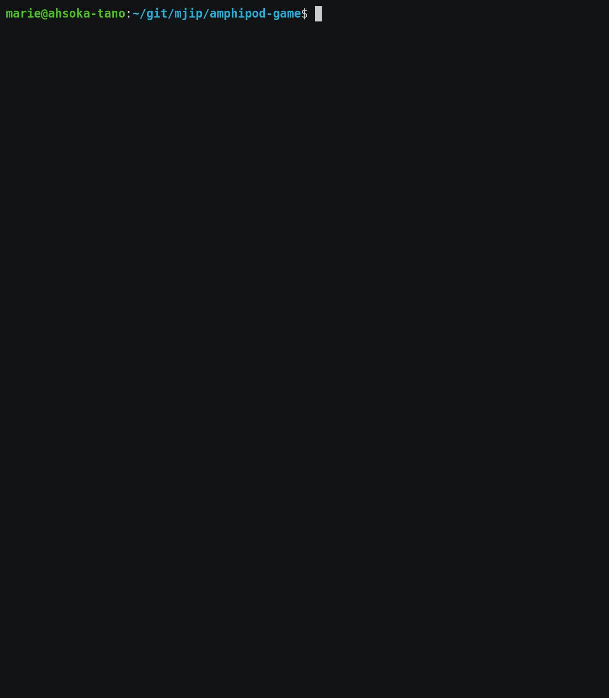

# Amphipod CLI Game Simulator


Command line Amphipod game simulator. Game rules are from Advent of Code 2021 day 23.
Written in Python3 with ncurses.
Once started, use `q` to quit and `r` to reset the game state.

## Manual Installation
```sh
git clone https://github.com/mjip/amphipod-game
cd amphipod-game
python -m pip install . --user
```

